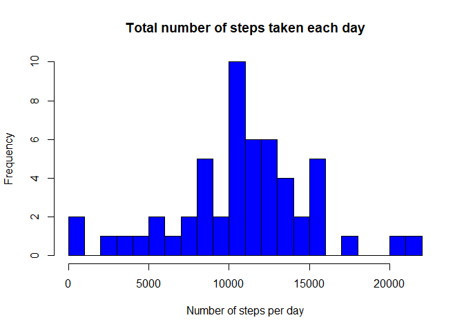
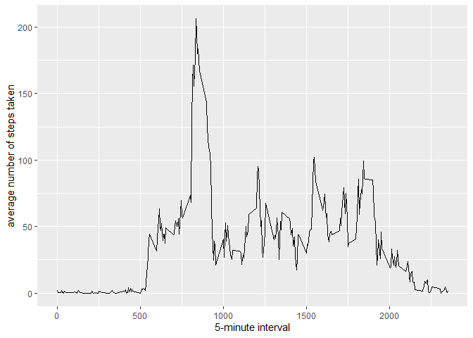
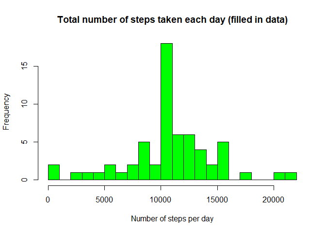
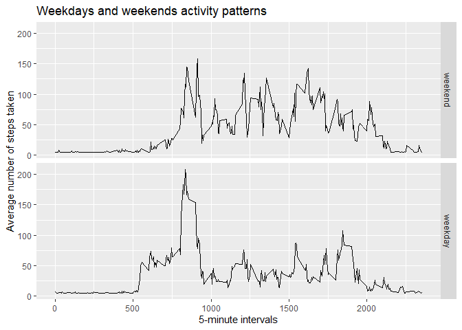

## Loading and preprocessing the data

``` r
data <- read.csv("activity.csv")
head (data)
```

```
##   steps       date interval
## 1    NA 2012-10-01        0
## 2    NA 2012-10-01        5
## 3    NA 2012-10-01       10
## 4    NA 2012-10-01       15
## 5    NA 2012-10-01       20
## 6    NA 2012-10-01       25
```

``` r
data <- transform (data, date = as.Date(date))
```

## What is mean total number of steps taken per day?


``` r
# Load the ggplot2 package
library (ggplot2)

# create a variable for total steps per day and name the date column

total_steps <- aggregate(data$steps, by = list(Date = data$date), FUN = "sum")

# calculate mean and median of total steps per day

mean_total <- mean(total_steps[,2], na.rm = TRUE)
median_total <- median(total_steps[,2], na.rm = TRUE)
```

The mean total number of steps taken per day is `mean_total`\
The median total number of steps taken per day is `median_total`


``` r
hist(total_steps$x, col = "blue", breaks = 20,
     main = "Total number of steps taken each day",
     xlab = "Number of steps per day")
```

<!-- -->

## What is the average daily activity pattern?


``` r
# Create a variable avg_daily
avg_daily <- aggregate(x=list(Steps = data$steps), 
                       by=list(Interval=data$interval), 
                       FUN="mean", na.rm=TRUE)

# Create a time series plot using ggplot function  

ggplot(data=avg_daily, aes(x= Interval, y= Steps)) +    
            geom_line() + xlab("5-minute interval") +
            ylab("average number of steps taken") 
```

<!-- -->

# Find the interval with the maximum number of steps


``` r
# Find the maximum number of steps within the available intervals
max_steps <- which.max(avg_daily$Steps)
# Find the interval where the maximum steps occurs
max_interval <- avg_daily[max_steps,1]
```

The interval with the maximum number of steps is `max_interval`\
The maximum number of steps within the above interval is `max_steps`

## Inputing missing values


``` r
# Find the total number of missing values
total_NA <- sum(is.na(data$steps))
```

The number of missing values is `total_NA`


``` r
# Create a new dataset
complete_data <- data
# Create a new variable which has location of all missing values
na_location <- which(is.na(complete_data$steps))
# Load the hmisc package
library(Hmisc)
```

```
## 
## Attaching package: 'Hmisc'
```

```
## The following objects are masked from 'package:base':
## 
##     format.pval, units
```

``` r
# Fill in the missing values with the mean value
complete_data$steps <- impute(complete_data$steps, fun = mean)
# Calculate the total steps, mean and median for the new dataset
Step_total <- aggregate(complete_data$steps, 
                           by = list(Date = complete_data$date), 
                           FUN = "sum")
Step_mean <- mean(Step_total[,2], na.rm = TRUE)
Step_median <- median(Step_total[,2], na.rm = TRUE)
mean_difference <- Step_mean - mean_total
median_difference <- Step_median - median_total
# Create a histogram with the filled in data
hist(Step_total$x, col = "green", breaks = 20,
     main = "Total number of steps taken each day (filled in data)",
     xlab = "Number of steps per day")
```

<!-- -->

The new mean total number of steps taken per day is `Step_mean`\
The new total number of steps taken per day is `Step_median` There was no difference in mean, but a `median_difference` change in median after filling the missing values.\
It can be concluded that there was no significant difference seen in the mean and median after filling in the data \## Are there differences in activity patterns between weekdays and weekends?


``` r
# Define the weekdays in a new variable
weekdays <- c("Monday", "Tuesday", "Wednesday", "Thursday", "Friday")

# use the new variable to factor between weekday and weekend
complete_data$Day <- weekdays(complete_data$date)
complete_data$Type_of_Day <- factor(complete_data$Day %in% weekdays,
                                    levels = c(FALSE, TRUE),
                                    labels = c("weekend", "weekday"))
# Separate weekday and weekend activity data in 2 new variables 
weekday_activity <- complete_data[complete_data$Type_of_Day == "weekday",]
weekend_activity <- complete_data[complete_data$Type_of_Day == "weekend",]
```

Using a panel plot to compare the activity patterns between weekdays and weekends 

``` r
# Calculate the total number of steps for both weekdays and weekends 
weekday_steps <- aggregate(x=list(Steps = weekday_activity$steps),
                           by = list(Type_of_Day = weekday_activity$Type_of_Day, 
                                     Interval = weekday_activity$interval),
                           FUN = "mean")
weekend_steps <- aggregate(x=list(Steps = weekend_activity$steps), 
                           by = list(Type_of_Day = weekend_activity$Type_of_Day,
                                     Interval = weekend_activity$interval), 
                           FUN = "mean")
# Make a new variable containing step data for both weekdays and weekends with intervals 
day_steps <- rbind (weekday_steps, weekend_steps)
#Create a 2 panel plot comparing the activity patterns for weekdays and weekends
ggplot(day_steps, aes(x = Interval, y = Steps)) + 
geom_line() + 
facet_grid(Type_of_Day ~ .) + 
xlab("5-minute intervals") + 
ylab("Average number of steps taken") + 
ggtitle("Weekdays and weekends activity patterns") 
```

<!-- -->

From the above plot, it can be observed that weekends have overall higher average activity, but there is an significant peak in activity during the mornings in weekdays
